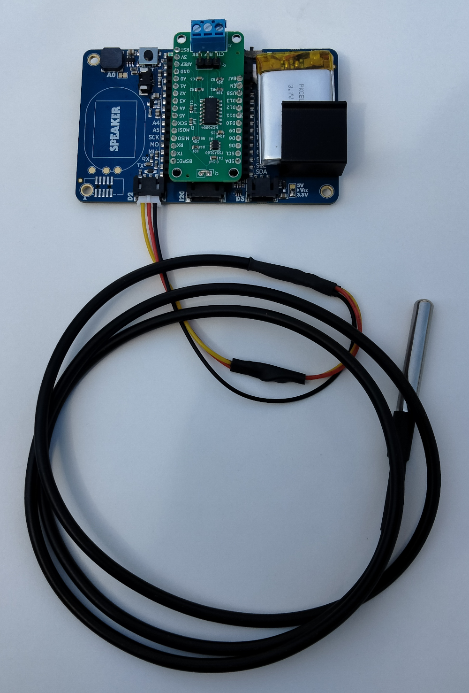
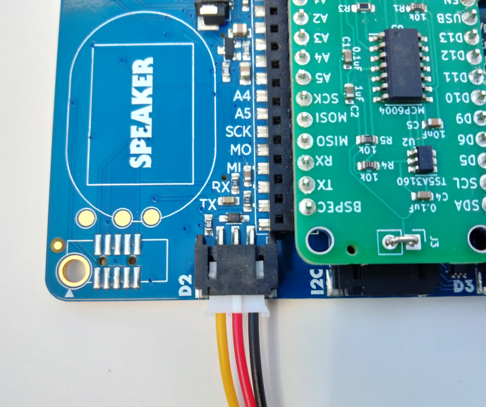
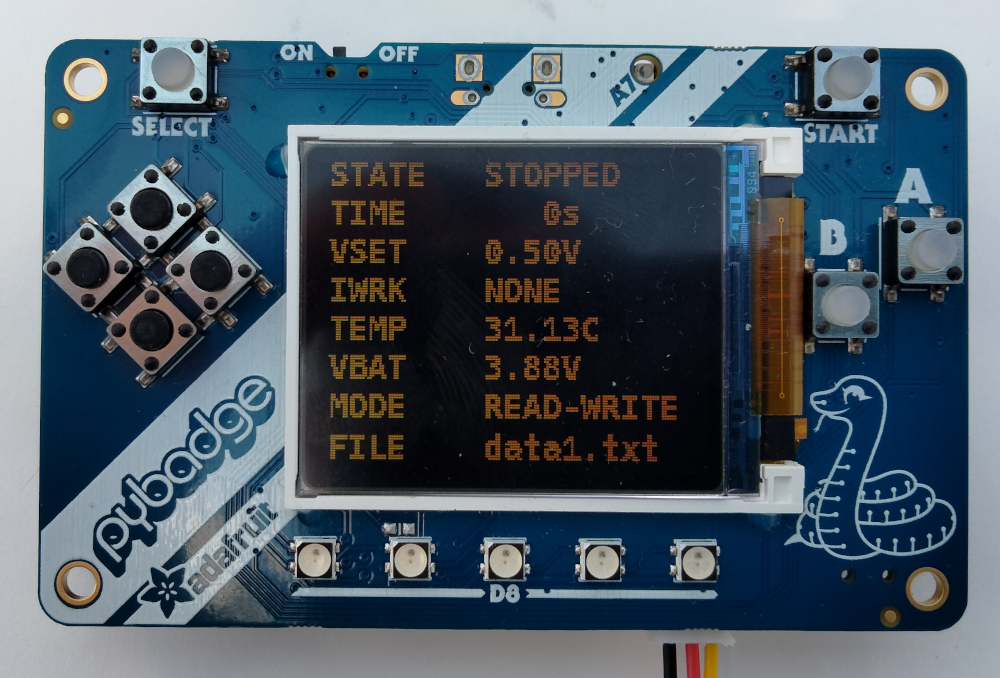

# rodeostat_featherwing_const_volt

Example firmware which implements a constant voltage voltammetry app
for the Rodeostat Feather and PyBadge. 

The function of the PyBadge buttons are shown in the figure below. 


* **Start Button**: connects electrode and starts acquisition. 

* **Stop Button**: stops acquisition and closes any open files.

* **Increase Voltage Button**: increases the set-point voltage. 

* **Decrease Voltage Button**: decreases the set-point voltage.  

* **Clear Files Button**: erases all data files. 

By default, when no buttons are pressed during startup the flash storage
will be read-write for circuitpython and read-only for the host PC (if
present).  This can be changed by pressing any button (except reset) during
startup during powerup of after a hard reset. In which case the flash
storage will be read-only for circuitpython and read-write for the host PC
(if present). 

When the flash storage is read-write data files will be written to a directory
named "data_files" on the PyBadge. The data files are named sequentially i.e.,
data1.txt, data2.txt, ... etc. The data consists of columns of time (s),
set-point voltage (V) and working electrode current (uA).   

The display on the PyBadge shows the following values:

* **STATE**: the acquisition state (STOPPED/RUNNING)
* **TIME**:  the acquisition time (seconds)
* **VSET**:  the set-point voltage (V)
* **IWRK**:  the current in/out of the working electrode (uA)
* **VBAT**:  the battery voltage (V)
* **MODE**:  flash storage mode (READ-WRITE/READ-ONLY)
* **FILE**:  the current data file (data1.txt, data2.txt, etc)


## Firmware Installation

The firmware has been tested on CircuitPython 9.1.1. 

Instructions for installing CircuitPython on the PyBadge can be found at [Adafruit](https://learn.adafruit.com/adafruit-pybadge/installing-circuitpython) 
and  [circuitpython.org](https://circuitpython.org/board/pybadge/).

The dependencies for the firmware can be installed using the
[circup](https://github.com/adafruit/circup) utilty which can be installed on
your development PC using pip.  

To install the dependencies using circup run the following  

```bash
circup install -r requirements.txt


```
from inside the projects top-level directory.  


To install constant voltage voltammetry firmware on the to PyBadge you can use
one of the two the provided upload scripts:  upload.bash and upload.ps1 for
bash and powershell respectively.  

To upload the firmware using the upload.bash script simply run 

``` bash
./upload.bash


```
from a bash shell within the projects "src" directry. 

To install the firmware using the powershell script, upload.ps1 run the .ps1
script   

```powershell
upload.ps1

```

from a powerhsell withing the project's "src" directory. 

## Optional DS18B20 Temperature Sensor

An option DS18B20 temperature sensor can be connected to the D2 header as shown
in the images below. 





Be sure to connect a 4.7k (or similar resistor between the D2 signal wire and
VCC). The temperature sensor and temperature measurements can be enabled and
configured via the constants.py file. Setting TEMP\_SENSOR\_ENABLED to True will
enable the temperature sensor. When the sensor is enable the display will show the
temperature values as shown below. 



Setting TEMP\_IN\_DATA\_FILE to True will add the temperature data as a fourth
column to the time, voltage and current data file.  

A temperature measurement schedule can be set via TEMP\_SENSOR\_SCHEDULE.  The schedule
is specified as a list of tuples where each tuple gives the start and stop times of the 
measurement window for temperature. 

```python

TEMP_SENSOR_SCHEDULE = [
        ( 5.0, 10.0),  # window #1 (t_start, t_stop)
        (20.0, 30.0),  # window #2 (t_start, t_stop) 
        ]              # ... etc

```
If a temperature schedule is specified then a separate temperature data file
will be written. By default this file will be called temp{n}.txt corresponding
the the nth data file. The prefix used for this file can be changed in the
constants.py file.  The file consists for columns of time, temperature and
average temperature recorded during each measurement window.  
